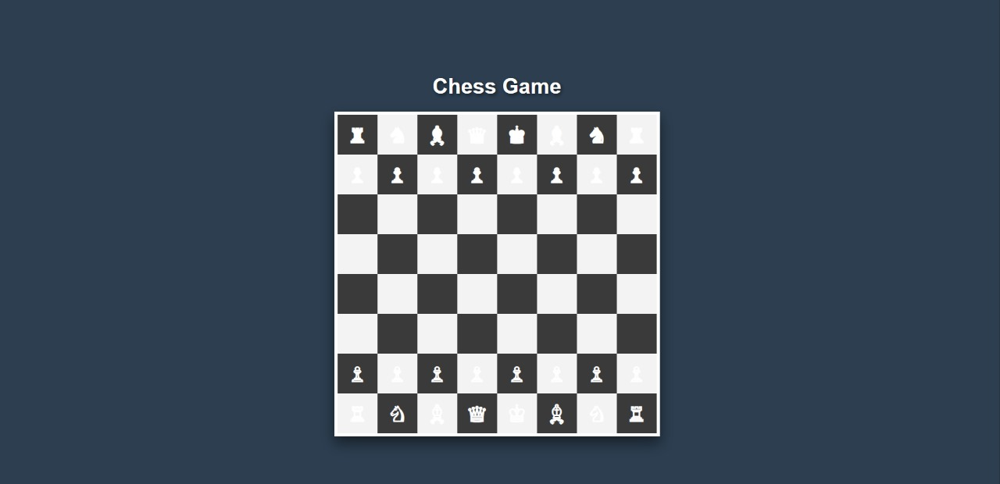

# 🏆 Chess Game UI Challenge

Welcome to the **Chess Game UI Challenge**! This challenge is designed for those who enjoy working with **HTML**, **CSS**, and **JavaScript**. Your task is to reassemble fragmented code and create a fully functional and visually appealing **chessboard interface**.

---

## 🎯 Challenge Objectives

1. Reassemble and fix the fragmented code provided in the `Folder-1` folder.
2. Achieve the **expected UI output** described in the README.
3. Optionally, enhance the UI further to showcase your creativity and skills!

---

## 📂 Folder Structure

```plaintext
Chess Game UI/
│
├── index.html         # Main HTML file for the chessboard
├── one.html           # Fragmented HTML file 1
├── two.html           # Fragmented HTML file 2
├── three.html         # Fragmented HTML file 2
├── four.html          # Fragmented HTML file 2
├── five.html          # Fragmented HTML file 2
├── six.html           # Fragmented HTML file 2
├── styles.css         # Main CSS file
├── one.css            # Fragmented CSS file 1
├── two.css            # Fragmented CSS file 2
├── expectedUI1.png    # Reference image for the expected UI
└── README.md          # Instructions for the challenge
```

---

## Expected UI



---


## 🌟 Bonus Points

- **+3 Extra Points**: Successfully complete the **Chess Game UI Challenge** and reassemble the fragmented code.

---

## 💻 What's Included?

- **HTML & CSS** files for a chessboard layout with grid-based styling.
- Fragmented code with misaligned structure and styling issues.
- Visual guide of the **expected UI** for reference.

---

## 🛠 Instructions

1. **Download the Repository**: 
   - Click on the **Code** button and select **Download ZIP**.
   - Extract the ZIP file and navigate to the `Folder-1` folder.

2. **Set Up the Project**:
   - Open the extracted folder in VS Code.
   - Download Live Server Extension from the Extensions section in the VS Code.  
   - Review the fragmented HTML and CSS files.

3. **Reassemble and Fix**:
   - Combine the fragmented files (`one.html`, `two.html`, etc.) into a single `index.html`.
   - Fix the styling issues and integrate the styles from `one.css`, `two.css`, and `styles.css` into a cohesive structure.

4. **Test the Output**:
   - Ensure the chessboard is displayed correctly.
   - Verify responsiveness and overall design.

5. **Submit Your Solution**:
   - Push your completed solution to your **GitHub repository**.
   - Share the GitHub repository link using the provided **Google Form**.

---

## 🕒 Time Limit

You have **1 hour and 15 minutes** (e.g., **10:45 AM - 12:00 PM**) to complete this challenge.

---

## 🎨 Bonus Creativity

Participants are encouraged to:
- Add unique animations or hover effects to the chessboard.
- Implement responsive design for better adaptability on smaller screens.
- Include innovative design ideas while maintaining the core chessboard functionality.

---

## 💡 Judging Criteria

1. **Accuracy**: Proper merging and integration of the fragmented files.
2. **Responsiveness**: The chessboard UI adapts well across different screen sizes.
3. **Creativity**: Use of animations, styling, and additional design elements.
4. **Code Quality**: Clean and readable code structure.

---

Unleash your creativity, showcase your logical thinking, and have fun! 🚀  
Good luck! 🎉
